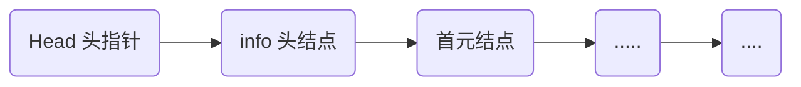
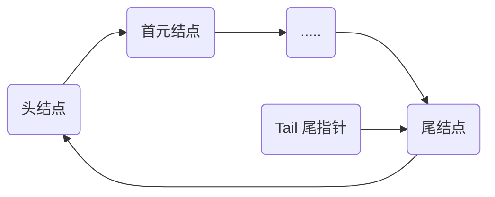
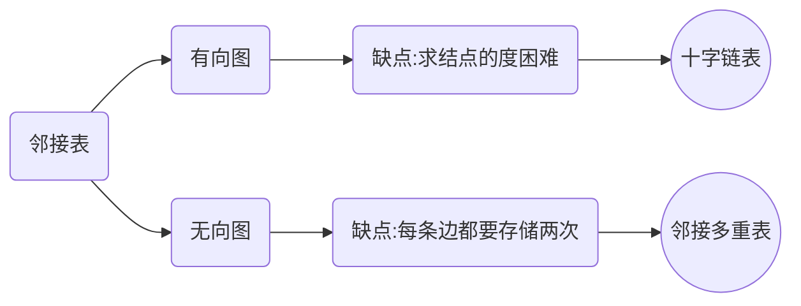

# 数据结构

## 线性表

### 线性表的类型定义

```c
ADT List{
   	数据对象: 
    数据关系:
	基本操作:
}ADT List
```

```c
// 基本操作:
void InitList(&L);
void DestroyList(&L);
void ClearList(&L);
bool ListEmpty(&L);
int ListLength(&L);
void GetElem(L, i, &e);
int LocateElem(L, e, compare());
void PriorElem(L, cur_e, &pre_e);
void NextElem(L, cur_e, &nex_e);
void ListInsert(&L, i, e);
void ListDelete(&L, i, &e);
void ListTraver(&L, visited());
```

### 线性表的线性存储结构的实现

#### 基本定义

```c
// 定义
#define LIST_INIT_SIZE 100
typedef struct{
    ElemType elem[LIST_INIT_SIZE];
    int length;
}SqList;

// 补充:数组的静态分配
typedef struct{
	ElemType elem[MAxSize];
    int length;
}SqList;

// 数组的动态分配(C语言)
typedef struct{
	ElemType *elem;
    int length;
}SqList;

SqList L;
L.elem = (ELemType*)malloc(sizeof(ElemeType)*Maxsize);
free(L.elem)	// 删除


// 数组的动态分配(C++)
Struct SqList{
    ElemType *elem;
    int length;
}

SqLsit L;
L.elem = new ElemType(Maxsize);
delete L.elem; 
```

#### 基本操作实现

```c
//	预定义常量和类型，函数结果状态代码
#define TRUE 1
#define FALSE 0
#define OK 1
#define ERROR 0
#define INFEASIBLE -1
#define OVERFLOW -2
// Status 是函数的类型，其值是函数结果状态代码
#define int Status;
#define char ElemType;

// 基本操作
Status InitList_Sq(SqList &L){
   	L.elem = new ElemType[MAXSIZE];
    if(!L.elem) exit(OVERFLOW);
    L.length = 0;
    return OK;
}

void DestroyList(SqList &L){
    if(L.elem) delete L.elem;
}

void ClearList(SqList &L){
   	L.length = 0;
}

int GetLength(const SqList &L){
    return (L.length);
}

int IsEmpty(const SqList &L){
    if(L.length == 0) return 1;
    else return 0;
}

int GetElem(const SqList &L, int i, ElemType &e){
    if(i<1 || i>L.length) return ERROR;
    e = L.elem[i-1];
    return OK;
}

// ASL(Average Search Length)
int LocateElem(const SqList &L, ElemType e){
    for(i=0; i<L.length; i++)
        if(L.elem[i] == e) return i+1;
    return 0;
}

Status ListInsert_Sq(SqList &L, int i, ElemType e){
    if(i < 0 || i > L.length + 1) return ERROR;
    if(L.length == MAXSIZE) return OVERFLOW;
    for(int j = L.length - 1, j >= i - 1, j--){
        L.elem[j + 1] = L.elem[j];
    }
    L.elem[i - 1] = e;
    L.length++;
    return OK;
}

Status ListDelete_Sq(SqList &L, int i, ElemType e){
    if(i < 1 || i > L.length) return ERROR;
    for(int j = i, j < L.length, j++){
        L.elem[j - 1] = L.elem[j];
    }
    L.length--;
    return OK;
}
```

#### 顺序表优缺点

+ 优点：
  + 储存密度大（结点本身所占存储量/结点结构所占储存量）
  + 可以随机存取表中任意元素
+ 缺点：
  + 在插入和删除某一元素时，需要移动大量元素
  + 浪费存储空间
  + 属于静态存储形式，数据元素的个数不能自由扩充

### 线性表的链式存储结构的实现

#### 单链表

##### 基本定义

+ 节点：数据元素的存储映像。有数据与和指针域两部分组成
+ 链表：n各节点有指针链组成一个链表



```c
// 基本定义
typedef struct student{
    char num[8];
    char name[8];
    int score;
    struct student *next;
}Lnode, *LinkList;

// 更常用的定义方式
typedef struct{
    char num[8];
    char name[8];
    int score;
}Student;

typedef struct Lnode{
    Student data;
    struct Lnode *next;
}Lnode, *LinkList;
```

引入头结点的好处

1. 便于首元结点的处理

   首元结点的地址保存在头结点的指针域中，所以对首元结点的操作和后续结点的操作一致

2. 便于空表和非空表的统一处理:

   头指针都是指向头结点的非空指针

3. 另外，头结点的数据域中可以储存数据，也可以不储存数据，但头结点不算入链表长度


##### 基本操作实现

```c
Status InitList_L(Linklist &L){
    L = new LNode; // 或者:L=(LinkList)malloc(sizeof(LNode))
    if(L == NULL) return ERROR;
    L->next = NULL;
    return OK;
}

Status DestroyList(LinkList &L){
    LNode *p;
    while(L != NULL){
        p = L;
        L = L->next;
        free(p); // delete p;
    }
    return OK;
}

Status ClearList(LinkList &L){
    LNode *p1, *p2;
    p1 = L->next;
    while(p1 = NULL){
        p2 = p1->next;
        free(p1);
        p1 = p2;
    }
    L->next = NULL;
    return OK;
}

int GetLength(const LinkList &L){
    int i = 0;
    LNode *p;
    p = L->next;
    while(p != NULL){
        i++;
        p = p->next;
    }
    return i;
}

void GetElem_L(const LinkList &L, int i, ElemType &e){
    LNode *p;
    p = L->next;
    int j = 1;
    while(p != NULL && j < i){
        p = p->next;
        j++;
    }
    if(p == NULL || j > i)	return ERROR;	//前者是i过大，后者是i过小
    e = p->data;
    return OK;
}

int LocateElem(const LinkList &L, const ElemType &e){
    LNode *p;
    p = L->next;
    int j = 1;
    while(p != NULL && e != p->data){
        p = p->next;
        j++;
    }
    if(p == NULL)	return 0;	//前者是i过大，后者是i过小
    return j;
}

Status ListInsert_L(LinkList &L, int i, const ElemType &e){
    LNode *p;
    p = L->next;
    int j = 1;
    while(p != NULL && j < i - 1){
        p = p->next;
        j++;
    }
    if(p == NULL || j > i - 1)	return ERROR;
    s = new LNode;
    s->data = e;
    s->next = p->next;
    p->next = s;
    return OK;
}

Status ListDelet_L(LinkList &L, int i, ElemType &e){
    LNode *p1, *p2;
    p = L->next;
    int j = 1;
    while(p != NULL || j < i - 1){
        p = p->next;
        j++;
    }
    if(p == NULL || j > i - 1) return ERROR;
    p2 = p1->next;
    p1->next = p1->next->next;
    delete p2;
    return OK;
}
```

##### 单链表的建立

```c
// 头插法
void CreateList_H(LinkList &L, int n){
    L = new LNode;	//L = (LinkList)malloc(sizeof(LNode));
	L->next = NULL;
	for(i = n; i > 0; i--){
        p = new LNode;
		cin >> p->data;
        p->next = L->next;
        L->next = p;
    }
}

// 尾插法
void CreateList_T(LinkList &L, int n){
    L = new LNode;
    L->next = NULL;
    LNode *r;
    r = L;
    for(i = 0; i < n; i--){
        p = new LNode;
        cin >> p->data;
        p->next = r->next;
        r->next = p;
        r = p;
    }
}
```

##### 单循环链表的建立




```c
// 单循环列表

// 不同于单链表，循环链表常常会使用尾指针，保证处理最后一个结点的高效性
// 带尾指针的循环链表的合并
LinkList Connect(LinkList Ta, LinkList Tb){
    p = Ta->next;
    Ta->next = Tb->next->next;
    delete Tb->next;
    Tb->next = p;
    return Tb;
}
```

#### 双向链表


```c
typedef struct DuLNode{
    Elemtype data;
    struct DuLNode *next, *prior;
}DuLNode, *DuLinkList;

// 双向链表插入操作
void ListInsert_DuL(DuListLink &L, int i, Elemtype e){
    DuLNode *p, *s;
    // 这里是默认getelem会返回指向i结点的指针
    if(!(p = GetElemP_DuL(L, i)))	return ERROR;
    s = new DuLNode;
    s->data = e;
    s->prior = p->prior;
    p->prior->next = s;
    s->next = p;
    p->prior = s;
    return OK;
}

// 双向链表的删除
void ListDelete_DuL(ListLink &L, int i, ElemType &e){
    DuLNode *p;
    if(!(p = GetElemP_DuL(L, i))) return ERROR;
    e = p->data;
    p->next->prior = p->prior;
    p->prior->next = p->next;
    free(p); // delete p
    return OK;
}
```


#### 链式表优缺点

+ 优点：

  + 结点空间可以动态的申请或释放；
  + 数据元素的逻辑次序靠结点的指针来指示，插入和删除时不需要移动数据元素。

+ 缺点

  + 存储密度小，每个结点的指针域需要额外占用存储空间，当每个节点的数字域所占字节不多时，指针域所占存储空间的比重显得大。
    $$
    存储密度=\frac{结点数据本身占用空间}{节点占用的空间总量}
    $$

+ 非随机存取结构，对任意结点的操作都要从头指针依次查找到该结点，增加了算法的复杂性。

### 链式表与顺序表的比较

1. 存取方式不同：顺序表是随机存取，链式表是顺序存取

### 线性表的应用

#### 线性表的合并$A'=A\cup B$

```c
void union(List &A, List &B){
    ElemType e;
    La_len = ListLength(La);
    Lb_len = ListLength(Lb);
    for(i = 1; i <= Lb_len; i++){
        GetElem(Lb, i , e);
        // 没有就插入
        if(!LocateElem(La, e)) ListInsert(&La, ++La_len, e);
    }
}
```


#### 有序表的合并

合并完的表也必须满足有序性

##### 顺序表的实现

```c
void MergeList_Sq(SqList LA, SqList LB, SqList &LC){
    ElemType *pa = LA.elem;
    ElemType *pb = LB.elem;
    LC.length = LA.Length + LB.length;
    LC.elem = new ElemType[LC.length];
    pc = LC.elem;
    ElemType *pa_last = LA.elem + LA.length - 1;
    ElemType *pb_last = LB.elem + LB.length - 1;
	while(pa <= pa_last && pb<= last){
        if(*pa <= *pb) 
            // 因为++的优先级高于*,所以++先作用于pc，但是由于++的作用是在所有运算完成后再将对象加1，所以等价于*pc = *pa; pc++; pa++;
            *pc++ = *pa++;
        else
            *pc++ = *pb++;
    }
    while(pa <= pa_last)	*pc++ = *pa++;
    while(pb <= pb_last)	*pc++ = *pb++;
}
```

##### 单链式表的实现

```c
void MergeList_L(LinkList &La, LinkList &Lb, LinkList &Lc){
    LNode *pa = La->next;
    LNode *pb = Lb->next;
    Lc = La;
    LNode pc = Lc;
    while(pa && pb){
        if(pa->data <= pb->data){
            pc->next = pa;
            pc = pa;
            pa = pa->next;
        }
        else{
            pc->next = pb;
            pc = pb;
            pb = pb->next;
        }
    }
    pc->next = pa ? pa : pb;
    free(Lb);
}
```


#### 一元多项式的运算(非稀疏多项式)

用数组即可


#### 系数多项式的运算

##### 顺序表的实现

```c
typedef struct{
    double coef;
    int index;
}term;

typedef struct{
    term *elem;
    int term;
}List;

void polynomial_add(List &LA, List &LB List &LC){
    term *pa = LA.elem;
    term *pb = LB.elem;
    LC.length = LA.length + LB.length;
	LC.elem = new term(LC.length);
    term *pc = LC.elem;
    term *pa_last = LA.elem + LA.length - 1;
    term *pb_last = LB.elem + LB.length - 1;
    while(pa <= pa_last && pb <= pb_last){
        if(pa->index < pb->index){
            *pc++ = *pa++;
        }
        else if(pa->index == pb->index){
            pc->index = pa->index;
            pc->coef = pa->coef + pb->coef;
            pa++;
            pb++;
            if(pc->coef != 0){
            	pc++;
            }
        }
        else{
            *pc++ = *pb++;
        }
    }
    while(pa <= pa_last)	*pc++ = *pa++;
    while(pb <= pb_last)	*pc++ = *pb++;
}
```

##### 链式表的实现

```c
typedef struct PNode{
    float coef;
    int expn;
    struct PNode *next;
}PNode, *Polynomial;

void CreatePolyn(Polynomial &P, int n){
    P = new PNode;
    P->next = NULL;
    for(int i = 0; i < n; i++){
        s = new PNode;
        cin >> s->coef >> s->expn;
        PNode *pre = P;
        PNode *q = P->next;
        while(q && q->expn < s->expn){
            pre = q;
            q = q->next;
        }
        s->next = q;
        pre->next = s;
    }
}

void polynomial_combine(Polynomial &PA, Polynomial &PB, Polynomial &PC){
    PNode *pa = PA->next;
    PNode *pb = PB->next;
    PC = PA;
    PNode *pc = PC;
    while(pa != NULL && pb != NULL){
        if(pa->expn < pb->expn){
            pc->next = pa;
            pc = pa;
            pa = pa->next;
        }
        else if(pa->expn == pb->expn){
            if(pa->coef + pb->coef == 0){
                PNode *pre_a, *pre_b;
                pre_a = pa;
                pre_b = pb;
                pa = pa->next;
                pb = pb->next;
                free(pre_a);
                free(pre_b);
            }
            else{
                PNode *pre_b;
               	pa->coef = pa->coef + pb->coef;
                pc->next = pa;
                pc = pa;
                pa = pa->next;
                
                pre_b = pb;
                pb = pb->next;
                free(pre_b);
            }
        }
        else(pa->expn > pb->expn){
            pc->next = pb;
            pc = pb;
            pb = pb->next;
        }
    }
    pc->next = pa ? pa : pb;
    free(PB);
}


```

## 栈和队列（操作受限）

### 栈和队列的定义


#### 栈

Stack是一个特殊的线性表，是限定仅在一端（通常是表尾）进行插入和删除的线性表。
栈顶Top，栈底Base

插入元素到TOP叫做**入栈**(PUSH)
删除TOP的元素叫做**出栈**(POP)

##### 特性

后进先出**LIFO**（新元素只能插入在表尾，删除也只能在表尾）

##### 存储结构

用顺序栈和链栈存储均可，但以顺序栈更常见

##### 应用

+ 数值转换
+ 括号匹配
+ 行编辑程序
+ 迷宫求解
+ 表达式求值
+ 八皇后问题
+ 函数调用
+ 递归调用的实现


#### 队列

queue是一个特殊的线性表，是限定仅在一端进行插入和删除的线性表（通常是头删尾插）。

##### 特性

先进先出**FIFO**（新元素只能插入在表尾，删除只能在表头）

##### 存储结构

用顺序栈和链栈存储均可，以循环顺序队列更常见】

##### 应用

+ 脱机打印输出：按申请的先后顺序
+ 多用户系统中，多用户排队，分时的循环使用CPU和主存
+ 按用户的优先级排成多个队，每个优先级一个队列
+ 实施控制系统中，信号按接受的先后顺序依次处理
+ 网络电文传输，按到达的时间先后顺序依次进行

### 栈和队列的使用案例

#### 进制转换

#### 括号匹配

#### 表达式求值

##### 算符优先算法

需要设置两个栈：

1. 一个是算符栈OPTR，用于寄存运算符
2. 一个是操作数栈OPND，用于寄存运算数和运算结果

运算过程：

1. 从左到右扫描表达式的每一个字符
2. 当扫描到的是运算符时
   + 若这个运算符比OPTR栈顶运算符的优先级高，则入栈OPTR，继续向后处理
   + 若这个运算符比OPTR栈顶运算符的优先级低，则从OPND栈中弹出两个运算数，从栈OPTR中弹出栈顶运算符进行运算，并将运算结果压入栈OPND
3. 继续处理当前字符，知道遇到结束符位置

#### 舞伴问题


### 栈的表示和操作的实现

#### 栈的抽象数据类型的类型定义

```c
ADT Stack{
	数据对象:
    数据关系:除了顺序外，还要约定an为栈顶，a1端为栈底
    基本操作:初始化，进栈，出栈，取栈顶元素等    
}ADT Stack
```

#### 栈的基本操作

```c
InitStack(&S);
DestroyStack(&S);
StackEmpty(S);
StackLength(S);
GetTop(S, &e);
ClearStack(&S);
Push(&S, e);
Pop(&S, e);
```

#### 顺序栈的表示和实现

通过设定两个指针来辅助完成操作，top指针指向栈顶元素在顺序栈中的位置（为了操作方便，常常指向栈顶元素之上的下标地址），base指针指向栈底元素在顺序栈中的位置。

另外用`stacksize`表示栈可使用的最大容量。

用数组作为顺序栈存储方式的特点

+ 简单，方便，但易产生溢出

上溢(Overflow)：栈已经满了，又要压入元素，是一种错误
下溢(Underflow)：栈已经空了，还要弹出元素，是一种结束标志

```c
#define MAXSIZE 100
typedef struct{
	SElemType	*base;
	SElemType	*top;
	int stacksize;
}SqStack;

Status InitStack(SqStack &S){
	S.base = new SElemType(MAXSIZE);
	// S.base = (SElemType*)malloc(MAXSIZE*sizeof(SElemType))
	if(S.base == NULL) exit OVERFLOW;
	S.top = S.base;
	S.stacksize = MAXSIZE;
	return OK;
}

Status StackEmpty(SqStack S){
	if(S.top == S.base)
		return TRUE;
	else
		return FALSE;
}

int StackLength(SqStack S){
	return S.top - S.base;
}

void ClearStack(SqStack &S){
	if(S.base) S.top = S.base;
	return OK;
}

Status DestroyStack（SqStack &S){
	if(S.base){
		delete S.base;
		S.stacksize = 0;
		S.base = S.top = NULL;
	}
	return OK;
}

Status Push(SqStack &S, SElemType e){
    if(S.top - S.base == S.stacksize)	exit OVERFLOW;
    *S.top++ = e;
    return OK;
}

Status Pop(SqStack &S, SElemType &e){
    if(S.top == S.base)	return FALSE;
    // 与*S.top++类似，因为++,--的优先级比较高，所以会先与S.top结合.再根据--和++自身的运算法则判断是应该先自减还是先取内容
    e = *--S.top;
    return OK;
}
```


#### 链式栈的表示和实现

这里使用单链来实现，其中next指针一般会指向上一个元素，即方向指向栈底，所以理论上他指向前驱，这与一般链中的next不一样。

另外链式栈只需要一个指针即可，永远指向栈顶的后面一个位置

+ 链式栈的头指针就是栈顶
+ 链式栈不需要头结点
+ 基本不存在栈满的情况
+ 空栈相当于头指针指向空
+ 插入和删除仅在栈顶处执行

```c
typedef struct StackNode{
   SElemType data;
   struct StackNode *next;
}StackNode, *LinkStack;
LinkStack S;

Status InitStack(LinkStack &S){
    S = NULL;
    return OK;
}

Status StackEmpty(LinkStack &S){
    if(S == NULL) return TRUE;
    return FALSE;
}

Status Push(LinkStack &S, SElemType e){
    StackNode *p;
    p = new StackNode;
    p->data = e;
    p->next = S;
    S = p;
    return OK;
}

Status Pop(LinkStack &S, SElemType &e){
    if(S == NULL)	return ERROR;
    e = S.data;
    StackNode *p;
    p = S;
    S = S->next;
    free(p);
    p = NULL;
    return OK;
}

SElemType GetTop(LinkStack S){
    if(S != NULL)
       	return S->data;
}
```


### 栈与递归

##### 递归的定义

+ 若一个对象部分地包含他自己，或用他自己给自己定义，则称这个对象是递归的
+ 若一个过程直接或间接的调用自己，这称这个过程为递归的

##### 递归的优缺点

+ 优点：结构清晰，程序易读
+ 缺点：每次调用要生成工作记录，保存状态信息，入栈；返回时要出栈，恢复状态信息。时间开销大。

##### 递归——>非递归

+ 尾递归，单项递归——>循环结构
+ 自用栈模拟系统的运行时栈

### 队列的表示和操作的实现

#### 队列的抽象数据类型的类型定义

```c
ADT Queue{
    数据对象:
    数据关系:除了顺序外，还要约定an为队列尾，a1端为队列头
    基本操作:初始化，进队，出队，取队头元素等    
}ADT Queue; 
```

#### 队列的基本操作

```c
InitQueue(&Q);
DestroyQueue(&Q);
QueueEmpty(Q);
QueueLength(Q);
GetTop(Q, &e);
ClearQueue(&Q);
EnQueue(&Q, e);
DeQueue(&Q, &e);
```

#### 顺序队列的表示和实现

用一维数组base[MAXQSIZE]来表示，用`front`和`rear`标定队列头和队列尾，然后规定真溢出和假溢出来达到顺序循环的效果

+ 真溢出：front为0，rear为MAXQSIZE。
+ 假溢出：front不为0，rear为MAXQSIZE。
+ 我们用mod（取余运算即可达到循环的效果）

但是使用循环顺序结构时，仅用`front`和`rear` 则难以区分队空和队满

+ 另外设置一个变量以标志元素个数
+ 少用一个元素空间(也很方便)

```c
#define MAXQSIZE 100
Typedef struct{
    QElemType *base;
    int front;
    int rear;
}SqQueue;

Status InitQueue(SqQueue &Q){
    Q.base = new QElemType(MAXQSIZE);
    if(!Q.base) exit OVERFLOW;
    Q.front = Q.rear = 0;
    return OK;
}

int QueueLength(SqQueue Q){
    // 注意C语言取模运算不能作用于负数，如(-6)%5 = -1而不是4,所以一定要先转换成正数，即加MAXQSIZE
    return	(Q.rear - Q.front + MAXQSIZE)%MAXQSIZE;
}

Status Enqueue(SqQueue &Q, QElemType e){
    if((Q.rear + 1) % MAXQSIZE == Q.front)	return ERROR;
    Q.base[Q.rear] = e;
    Q.rear = (Q.rear + 1) % MAXSIZE
}

Status Dequeue(SqQueue &Q, QElemType &e){
    if(Q.rear == Q.front)	return ERROR;
    e = Q.base[Q.front];
 	Q.front = (Q.front + 1) % MAXSIZE
}

SElemType GetHead(SqQuere Q){
    if(Q.front!= Q.rear)
        return Q.base[Q.front];
}
```

#### 链式队列的表示和实现

注意这里与顺序队列不同点在于使用的头和尾的标志是指针类型变量

这里与链式栈不同点在于需要使用队头和队尾指针来表示整个队列，而链式栈则只需要用一个指向top上面一个元素的指针

另外链式栈一般没有头结点(即第一个元素是`S->data`)，但是链式栈的指针往往是上一个元素所以还是应该是`S->next->data`，但是链式队列一般会设置头结点(即第一个元素是`Q->next->data`)

再另外，链式栈的next指针往往指向前面一个元素，而链式队列next指针则指向后面一个元素

```c
#define MAXQSIZE 100
typedef struct Qnode{
    QElemType data;
    struct Qnode *next;
}QNode, *QuenePtr;

typedef struct{
    QuenePtr front;
    QuenePtr rear;
}LinkQueue;
LinkQueue Q;

Status InitQueue(LinkQueue &Q){
    Q.front = Q.rear = (QueuePtr)malloc(sizeof(QNode));
    if(!Q.front) exit OVERFLOW;
    Q.front->next = NULL;
    return OK;
}

Status DeleteQueue(LinkQueue &Q){
    QNode *p;
    while(Q != NULL){
        p = Q.front->next;
        free(Q.front);
        Q.front = p;
    }
    // 可以直接用Q.rear代替p，因为反正也是不要了
    return OK;
}

Status EnQueue(LinkQueue &Q, QElemType e){
    QNode *p = new QNode;
    p->data = e;
    p->next = NULL;
    Q.rear->next = p;
    Q.rear = Q.rear->next;
    return OK;
}

Status DeQueue(LinkQueue &Q, QElemType &e){
    if(Q.front == Q.rear) return ERROR;
    e = Q.front->data;
    QNode *p;
    p = Q.front;
    Q.front = Q.front->next;
    free(p);
    p = NULL;
}

QElemType GetHead(LinkQueue Q){
    if(Q.front == Q.rear)	return ERROR;
    return Q.front->next->data
}
```


## 串，数组和广义表（内容受限）

### 串

#### 串的定义

串是由零个或者多个任意字符组成的有序数列。

> 子串：一个串中任意个连续子船组成的子序列（含空串）
>
> 字符位置：字符在序列中的序号为该字符在串中的位置
>
> 子串位置：子串中第一个字符在主串中的位置
>
> 空格串：有一个或者多个空格组成的串，与空串不同


#### 串的应用

计算机中非数值处理的对象大部分是字符串数据，例如：文字编辑，符号处理，各种信息处理系统等等

##### 病毒感染检测（DNA，RNA序列）

病毒DNA是环状的，人的DNA是链状的。


#### 串的抽象数据类型的类型定义

```c
ADT String{
	数据对象:元素必须是字符
    数据关系:
    基本操作:
}ADT
```


#### 串的基本操作

```c
StrAssign(&T, chars);//串赋值
StrCompare(S, T);	//串比较
StrLength(S);		//求串长
Concat(&T, S1, S2);	// 串连结
SubString(&Sub, S, pos, len);	//求子串
StrCopy(&T, S);		//串拷贝
StrEmpty(S);		//串判空
ClearString(&S);	//清空串
Index(S, T, pos);	//子串位置
Replace(&S, T, V);	//串替换
StrInsert(&S, pos, T);	//子串插入
```


#### 顺序串的表示和实现

```c
#define MAXLEN 255
typedef struct{
    char *ch[MAXLEN + 1];
    int length;
}SString;


```


#### 链串的表示和实现

如果单纯的每一个结点储存一个字符，则存储密度会过低，所以我们会采用块链结构

```c
#define CHUNKSIZE 80
typedef struct Chunk{
    char ch[CHUNKSIZE];
    struct Chunk *next;
}Chunk;

typedef struct{
    Chunk *head, *tail;
    int curlen;
}LString;

可以自己动手写写
```


#### 串的模式匹配

##### 算法目的：

​	确定主串中所含子串(模式串)第一次出现的位置(定位)

##### 算法应用：

​	搜索引擎，拼写检查，语言翻译，数据压缩

##### 算法种类：

+ BF算法（Brute-Force，又称为古典的，经典的，朴素的，穷举的）
+ KMP算法（特点：速度快）

##### BF算法

亦称简单匹配算法，采用穷举法思想

```c
int Index_BF(const SString &S,const SString &T){
    int i = 1; j = 1;
    while(i<=S.length && j<=T.length){
        if(s.ch[i] == t.ch[j]){++i; ++j}
        else{i = i - j + 2; j = 1;}
    }
    if(j > T.length) return i - T.length;
    else return 0;
}
```

##### KMP算法

人名命名的算法，主要改进在于指针`i`不用回溯了，并且指针`j`会根据一定的规则回溯


$$
next[j]=\left\{
\begin{aligned}
max\{k|1<k<j, &且"p_1...P_{k-1}"="p_{j-k+1}...p_{j-1}"\} \\
0,当j=1\\
1,其他情况
\end{aligned}
\right.
$$


```c
int Index_KMP(SString S, SString T, int pos){
    i = pos, j = 1;
    while(i<length && j<T.length){
        if(j == 0 || S.ch[i] == T.ch[j]){i++; j++}
        else
            j = next[j];
    }
    if(j > T.length) return i-T.length;
    else return 0;
}

void get_next(SString T, int &next[]){
    i = 1; next[1] = 0; j = 0;
    while(i < T.length){
        if(j == 0 || T.ch[i] == T.ch[j]){
        	++i; ++j;
        	next[i] = j;
    	}
    	else
        	j = next[j];
	}
}
```

`KMP`算法的关键在于如何找到`next`数组，以及改进的`nextval`数组。

以下是next数组的生成示意图，在生成next数组时，我们需要两个指针，一个是只向前进`i`，另一个会进行回溯`j`。

我们不断地算出`next[i]`的值即可，我们很容易想到，当`i`和`j`的指向元素的值一样的时候，`i`和`j`都应该自加1然后将`j`所指向元素的index赋值给新的`i`所指向`next`数组中的元素，然后当不匹配的时候，则会将`j`回溯，令`j`赋值为所指向`next`数组中元素，因为前面几个的元素次序都是相同的，这样可以大大加快next数组生成的速度。


若遇到类似`aaabaaaab`这样的主串匹配子串`aaaa`时，在比较时，当`i`指向`b`时，`j`会指向`next[j]`，即前面一个的`a`，然后一步一步往前指，直到`j`变成0，这里我们引入`nextval`数组，来避免这种情况的产生。

|         | a    | b    | a    | a    | b    | c    | a    | c    | b    |
| ------- | ---- | ---- | ---- | ---- | ---- | ---- | ---- | ---- | ---- |
| 模式串P | 1    | 2    | 3    | 4    | 5    | 6    | 7    | 8    | 9    |
| next    | 0    | 1    | 1    | 2    | 2    | 3    | 1    | 2    | 1    |
| nextval | 0    | 1    | 0    | 2    | 1    | 3    | 0    | 2    | 1    |

生成原理很简单，将对于`nextval[i]`，若`P[i] == P[next[i]]`，比较`P[i] == P[next[next[i]]]`，直到不一样为止，此时`nextval[i] = 那个首先不一样的元素对应的i`

> 如果有时间，可以研究一下`nextval`数组的生成原理


### 数组

#### 数组的定义

按一定格式排列起来的，具有相同类型的数据元素的集合。


#### 声明格式

`数据类型 变量名称[行数][列数]`

对于二维数组，其可以被定义成一个一维数组类型（其分量为一维数组类型），即:

`typedef elemtype array2[m][n];` == ` typedef elemtype array1[n]; typedef arrat1 array2[m];`


#### 数组的抽象数据类型的类型定义

```c
ADT Array{
	数据对象:
	数据关系:每一个数据对象的前驱和后继有n个，n为数组的维数
	基本操作:很少
}
```


#### 数组的基本操作

除了结构的初始化和销毁之外，只有取元素的值和修改元素值的操作

```c
InitArray(&A, n, bound1,...boundn);
DestroyArray(&A);
Value(A, &e, index1,...,indexn);
Assign(A, &e, index1,...,indexn);
```


#### 数组的顺序存储的表示和实现

数组结构固定，一般不插入和删除所以通常会采用顺序存储结构

一维数组自不必说，我们关注二维数组的顺序存储方式
$$
两种顺序存储方式=\left\{
\begin{aligned}
以行序为主序（一行一行，行尾到行头的连结起来）\ &\ BASIC,COBOL和PASCAL,C,Java\\
以列序为主序（一列一列，列尾到列头的连结起来）\ &\ FORTRAN
\end{aligned}
\right.
$$


#### 特殊矩阵的压缩存储

##### 常规存储

​	将矩形描述为一个二维数组

##### 矩阵的压缩存储：

​	为多个相同的非零元素只分配一个存储空间；对零元素不分配空间。

###### 什么样的矩阵能够压缩？

​	对称矩阵，对角矩阵，三角矩阵，稀疏矩阵

###### 什么是稀疏矩阵？

​	非零元素不超过5%

##### 特殊矩阵

###### 对称矩阵

$a_{ij}=a{ji}$

+ 存储规则，存一半，一般是下三角
+ 重点是计算想要元素的对应下标

###### 三角矩阵

$a_{ij}=C,i<j\ or j<i$

+ 存储规则，存一半，然后再加上一个常数C，一共需要占用$\frac{n(n+1)}{2}+1$个空间

###### 对角矩阵（带状矩阵）


+ 存储规则，利用二维矩阵进行存储


###### 稀疏矩阵

+ 存储规则
  + 三元组法(有序的双下表法)
    + 直接把位置信息和值信息绑定即可`(行数，列数，值)`
    + 另外在整个三元组的第一个元素确定为`(总行数，总列数，非零元素总个数)`
    + 缺点：不够灵活
  + 稀疏矩阵的链式存储结构：十字链表
    + 每个非零元素用一个结点来表示
    + 该节点除了（row，col，value）以外，还有两个域
      + right：用于连接同一行中的下一个非零元素
      + down：用于连接同一列中的下一个非零元素
    + 另外我们添加一些`M.chead`和`M.rhead`，若此行或者此列没有非零元素，则头指针指向NULL。
    + 


### 广义表

不同于线性表，广义表(又称为列表，List)中的每一个元素或者是一个原子，或者是一个广义表，即可以是不同类型的数据


#### 广义表的定义

+ 广义表记作: $LS = (a_1,a_2,...)$
+ 习惯上，一般用大写字母表示广义表，小写字母表示原子
+ 表头：若LS非空，则其第一个元素就是表头
+ 表尾：除表头外的其他元素组成的表（不是最后一个元素，而是子表），注意（）括号不能省掉
  + $C = (a,(b,c))$，表头是$a$,表尾是$((b,c))$


#### 广义表的性质

+ 广义表的数据有相对次序，一个直接前驱和直接后驱
+ 广义表的长度定义为最外层所包含的元素个数
+ 深度定义为广义表展开后所包含括号的重数
+ 广义表可以为其他广义表共享
+ 广义表可以是一个递归的表，即自己包括自己
+ 广义表是多层次的结构，广义表的元素可以是单元素，也可以是子表，而子表的元素还可以是子表...


#### 广义表的应用

+ 他可以兼容线性表，数组，树和有向图等多种常用的数据结构
+ 比如二维数组就可以看做是一个广义表，他的每一列（或每一行）都是一个广义表
+ 另外树和有向图也可以用广义表来表示


#### 广义表的基本运算

```c
GetHead(L);

GetTail(L);
```


### 案例分析与实现

#### 病毒感染检测


## 树与二叉树

### 树

#### 树的定义

树是n个结点的有限集
	若n=0，称为空树；
	若n>0，则他满足以下两个条件：
		1.有且仅有一个特定的称为**根**的结点；
		2.其余节点可分为m个互不相交的有限集，每一个集合本身又是一棵树，并成为根的子树


#### 树的基本术语

| 术语                     | 定义                           |
| ------------------------ | ------------------------------ |
| 根结点                   | 非空树中无前驱结点的结点       |
| 结点的度                 | 结点拥有的子树数               |
| 树的度                   | 树内各节点的度的最大值         |
| 分支节结点（非终端结点） | 度 ≠ 0的结点                   |
| 内部结点                 | 根节点以外的分支结点           |
| 叶子（终端结点）         | 度 ＝ 0的结点                  |
| 树的深度                 | 树中结点的最大层次             |
| 有序树                   | 树中结点的各子树从左至右有次序 |
| 无序树                   | 树中各结点的各子树无次序       |
| 森林                     | m棵互不相交的树的集合          |


### 二叉树的基本概念

#### 为何要研究二叉树？

1. 二叉树的结构最简单，规律性最强
2. 可以证明，所有的树都能够转为唯一对应的二叉树，不失一般性


#### 二叉树的定义

**二叉树**是n个结点的有限集，它或者是空集，或者有一个根节点及两颗互不相交的分别称作这个根的**左子树**和右子树的二叉树组成


#### 二叉树的特点

1. 每个结点最多有两个孩子（二叉树中不存在度大于2的结点）
2. 子树有左右之分，其次序不能颠倒
3. 二叉树可以是空集合，跟可以有空的左子树或者空的右子树


#### 为何“二叉树不是树的特殊情况，他们是两个概念”？

二叉树结点的子树区分左子树和右子树，即使只有一颗子树也进行区分，说明其是左子树还是有子树
树当结点只有一个孩子时，就无须区分他是左还是右的次序。
因此两者是不同的，这是二叉树与树的最主要差别


#### 二叉树的抽象数据类型定义

```c
ADT BinaryTree{
    数据对象D;	D是具有相同特性的数据元素的集合。
    数据关系R;	若D=∅，则R=∅
        	   若D≠∅，则R={H};H是如下二元关系
        		1. root唯一
        		2. Dj∩Dk = ∅
        		3. 数据元素的说明
        		4. 关于左子树和右子树的说明
    基本操作P: //至少有20个
}
```


#### 二叉树的基本操作

```c
CreateBiTree(&T, definition){
    初始条件: definition给出二叉树T的定义;
    操作结果: 按definition构造二叉树T;
}

PreOrderTraverse(T){
    初始条件: 二叉树T存在;
    操作结果: 先序遍历T，对每个结点访问一次;
}

InOrderTraverse(T){
    初始条件: 二叉树T存在;
    操作结果: 中序遍历T，对每个结点访问一次;
}

PostOrderTraverse(T){
    初始条件: 二叉树T存在;
    操作结果: 后序遍历T,对每个结点访问一次;
}
```


#### 特殊形式的二叉树

##### 满二叉树

###### 定义

​	一颗深度为k，且有$2^k-1$个结点的二叉树称为满二叉树。

###### 特点

 	1. 每一层上的结点数都是最大结点数
 	2. 叶子结点全部在最底层


##### 完全二叉树

###### 定义

​	一颗深度为k，且具有n个结点的二叉树，当且仅当其每一个结点都与深度为k的满二叉树中编号为1~n的结点一一对应时，称之为完全二叉树

特点

1. 叶子只可能分布在层次最大的两层上

2. 对任一结点，如果其右子树的最大层次是$i$，则其左子树的最大层次必为 $i$ 或 $i+1$


#### 二叉树的性质

1. 在二叉树的第 $i$ 层上至多有$2^{i-1}$个结点。
2. 深度为k的二叉树至多有$2^k-1$个结点
3. 对任何一个二叉树$T$，如果其叶子树为$n_0$，度为2的结点数为$n_2$，则$n_0=n_2+1$。

$$
设总边数为B,总结点数为n,度为2的结点数为n_2,度为1的结点数为n_1,叶子数为n_0\\
则有\\
B = n - 1\\
B = 2n_2 + n_1\\
于是有\\
n = 2n_2+n_1+1\\
n = n_2+n_1+n_0\\
故得结论\\
n_0 = n_2+1
$$

4. 具有n个结点的完全二叉树的深度为$\lfloor log_2n \rfloor + 1$
5. 如果对一颗有n个结点的完全二叉树（深度是$\lfloor log_2n \rfloor + 1$）的结点按层序排序（从第1层到第$\lfloor log_2n \rfloor + 1$层，每层从左到右），则对于任一结点$i$($1 \le i \le n$)，有:
   1. 如果$i=1$,则结点$i$是二叉树的根，无双亲；如果$i>1$，则其双亲是结点$\lfloor i/2 \rfloor$
   2. 如果$2i>n$，则结点$i$为叶子结点，无左孩子；否则，其左孩子是结点$2i$
   3. 如果$2i+1>n$，则结点$i$无右孩子；否则，其右孩子是结点$2i+1$


### 二叉树的实现

#### 二叉树的顺序存储结构

实现：按照**满二叉树**的结点层次编号，依次存放二叉树中的数据元素，其中没有元素的位置用空元素代替（还是要占空间）。

```c
#define MAXTSIZE 100
Typedef TElemType SqiTree[MAXTSIZE];
SqBiTree bt;
```

缺点：非常的浪费空间

适用情况：满二叉树或者完全二叉树


#### 二叉树的链式存储结构

实现：

1. 二叉链表

| 左孩子指针 | 数据   | 右孩子指针 |
| ---------- | ------ | ---------- |
| `lchild`   | `data` | `rchild`   |

```c
typedef struct BiNode{
    TElemType data;
    struct BiNode *lchild, *rchild;//左右孩子指针
}BiNode, *BiTree;
```

2. 三叉链表

| 左孩子指针 | 数据   | 双亲指针 | 右孩子指针 |
| ---------- | ------ | -------- | ---------- |
| `lchild`   | `data` | `parent` | `rchild`   |

```
typedef struct BiNode{
    TElemType data;
    struct BiNode *lchild, *rchild, *parent;//左右孩子指针
}BiNode, *BiTree;
```


### 二叉树的遍历

#### 遍历的定义

\][POIRLLOZik顺着某一条搜索路径寻访二叉树中的结点，使得每个结点均被访问一次，而且仅被访问一次（又称周游）

#### 遍历的目的

得到树中所有结点的一个线性排列

#### 遍历用途

它是树结构插入，删除，修改，查找和排序运算的前提，是二叉树一切运算的基础和核心

#### 遍历方法

假设：L: 遍历左子树，D: 遍历根结点，R: 遍历右子树

则遍历整个二叉树的方案有6种：

1. DLR
2. LDR
3. LRD
4. DRL
5. RDL
6. RLD

若规定**先左后右**，则只有前三种情况：

1. DLR————先(根)序遍历
2. LDR————中(根)序遍历
3. LRD————后(根)序遍历

#### 遍历序列确定二叉树

+ 若二叉树中各结点的值均不相同，则二叉树结点的先序序列，中序序列和后序序列都是唯一的
+ 有二叉树的先序序列和中序序列，或由二叉树的后序序列和中序序列可以确定唯一一颗二叉树

情况一：利用先序和中序确定二叉树

1. 利用先序确定根结点，利用根结点和中序确定左右子树
2. 对左右子树分别再进行上述操作，直至画出来

情况二：利用后序和中序确定二叉树

1. 利用后序确定根结点，利用根结点和中序确定左右子树
2. 对左右子树分别再进行上述操作，直至画出来


#### 递归遍历

以二叉链表方式存储的二叉树为例

```c
Status PreOrderTraverse(BiTree T){
    if(T == NULL) return OK;
    else{
        visit(T);	//访问根结点
        PreOrderTraverse(T->lchild);
        PreOrderTraverse(T->rchild);
    }
}

Status InOrderTraverse(BiTree T){
    if(T == NULL) return OK;
    else{
        InOrderTraverse(T->lchild);
        visit(T);	//访问根结点
        InOrderTraverse(T->rchild);
    }
}

Status PostOrderTraverse(BiTree T){
    if(T == NULL) return OK;
    else{
        PostOrderTraverse(T->lchild);
        PostOrderTraverse(T->rchild);
        visit(T);	//访问根结点,可以是修改，打印等各种操作
    }
}
```

分析：

+ 易知，如果去掉访问语句，从递归的角度看，三种算法是完全相同的，或者说这三种算法的访问路径是相同的，只是访问结点的时机不同。其中
  + 第一次经过时访问=先序遍历
  + 第二次经过时访问=中序遍历
  + 第三次经过时访问=后序遍历


#### 非递归遍历（利用栈）

以二叉链表方式存储的二叉树为例

```c
Status InOrderTraverse(BiTree T){
    BiNode* p;
    InitStack(S); 
    p = T;
    while(p || !StackEmpty(S)){
        if(p){Push(S, p); p = p->lchild;}
        else{Pop(S, q); printf("%c", q->data); p = q->data;}
    }//while
    return OK;
}
```

栈实现的过程：

 	1. 首先将树的根赋给指针p
 	2. 若p不为空则入栈，并将p指向p的左孩子结点（左子树的根）
 	3. 若p不为空则入栈，继续将p指向p的左子树的根
 	4. 若p为空则出栈，访问p，然后将p指向p的右子树的根
 	5. 重复上述，直至栈中所有元素都已经出栈 且 p指针指向NULL


#### 层次遍历（利用队列）

对于一颗二叉树，从根结点开始，按从上到下，从左到右的顺序访问每一个结点，每一个结点仅访问一次

算法设计思路：

1. 将根结点进队；
2. 队不空时循环：从队列中出列一个结点*p，访问它；
   1. 若它有左孩子结点，将左孩子结点进队，
   2. 若它有右孩子结点，将右孩子结点进队。

```c
typedef struct{
    BTNode data[MaxSize];
    int front, rear;
}SqQueue;
```


```c
void LevelOrder(BTNode *b){
    BTNODE *p;
    SqQueue *qu;
    InitQueue(qu);	//	初始化队列
    enQueue(qu, b);	//	根结点指针进入队列
    while(!QueueEmpty(qu)){
        deQueue(qu, p);	//	出队列
        print("%c", p->data);	//	访问
        if(p->lchild != NULL) enQueue(qu, p->lchild);	//	左孩子进入队列
        if(p->rlchild != NULL) enQueue(qu, p->rchild);	//	右孩子进入队列
    }
}
```


#### 遍历算法的应用(利用递归)

##### 二叉树的建立

按先序遍历序列建立二叉树的二叉链表

例：已知某二叉树的先序序列为：`ABC##DE#G##F###`（`#`代表空元素，旨在唯一确定这颗二叉树），若题目给出的是先序序列和后学序列，则你也可以用这种添加"`#`"的方式仅用先序序列位移确定这颗二叉树

```c
Status CreateBiTree(BiTree &T){
	scanf(&ch);	// cin>>ch
    if(ch == "#") T=NULL;
    else{
        if(!(T = (BiTNode*)malloc(sizeof(BiTNode))))	// T = new BiTNode
            exit(OVERFLOW);
        T->data = ch;
        CreateBiTree(T->lchild);
        CreateBiTree(T->rchild);
    }
    return OK;
}
```


##### 二叉树的复制

利用其先序遍历的观点：

1. 如果是空树，递归结束；
2. 否则，申请新结点空间，复制根结点
   1. 递归复制左子树
   2. 递归复制右子树

```c
int Copy(BiTree T, BiTree &NewT){
    if(T == NULL){
        NewT = NULL;
        return 0;
    }
    else{
        NewT = new BiTNode;
        NewT->data = T->data;
        Copy(T->lchild, NewT->lchild);
        Copy(T->rchild, NewT->rchild)
    }
}
```


##### 二叉树的深度

+ 如果是空树，则深度为0；
+ 否则，递归计算左子树的深度即为m，递归计算右子树的深度即为n，二叉树的深度则为m与n的较大者加1。

```c
int Depth(BiTree T){
    if(T == NULL)
        return 0;
    else{
       	m = Depth(T->lchild);
        n = Depth(T->rchild);
        if(m > n) return m + 1;
        else return n + 1;
    }
}
```


##### 二叉树的总结点数

+ 如果是空树，则深度为0；
+ 否则，递归计算左子树和右子树的结点个数，二叉树的结点个数为左子树+右子树+1；

```c
int NodeCount(BiTree T){
    if(T == NULL)
        return 0;
    else
        return NodeCount(T->lchild)+NodeCount(T->rchild)+1;
}
```


##### 二叉树的叶子结点数

```c
int LeafCount(BiTree T){
    if(T == NULL)
        return 0;
    if(T->lchild == NULL && T->rchild == NULL)
        return 1;
    else
        return LeafCount(T->lchild)+LeafCount(T->rchild);
}
```


### 线索二叉树

**利用二叉链表中的空指针域**：如果某个结点的左孩子为空，则将空的左孩子指针域改为指向其前驱；如果某个结点的右孩子为空，则将空的有孩子指针域改为指向其后继，这种改变指向的指针称为“线索”，加了线索的二叉树称为**线索二叉树(Threaded Binary Tree)**，对二叉树按某种遍历次序使其变为线索二叉树的过程叫做**线索化**

注：这里的前驱和后继指的是该二叉树按某个次序遍历后得到序列的前驱和后继

为了区分`lrchild`和`rchild`指针到底是指向孩子的指针，还是指向前驱或者后继的指针，对二叉链表中每个结点增设两个标志域`ltag`和`rtag`，并约定:

+ `ltag = 0`	`lchild`指向该结点的左孩子
+ `ltag = 1`    `lchild`指向该节点的前驱 
+ `rtag = 0`	`rchild`指向该结点的右孩子
+ `rtag = 1`    `rchild`指向该节点的后继 


为了操作方便，增设一个头结点，让悬空的指针指向头结点。

头结点

| lchild | ltag | data | rtag | rchild                 |
| ------ | ---- | ---- | ---- | ---------------------- |
| 根结点 | 0    | None | 1    | 遍历序列的最后一个结点 |

规定：遍历序列中的第一个结点的lc域和最后一个结点的rc域都指向头结点


### 树和森林

#### 树的存储结构


##### 双亲表示法

实现：定义结构数组，存放树的结点，每个结点包含两个域

+ 数据域：存放节点本身信息
+ 双亲域：指示本结点的双亲结点在数组中的位置（其中根结点的双亲结点位置为-1）

```c
typedef struct PTNode{
    TElemType data;
    int parent;	//双亲位置域
}PTNode;

#define MAX_TREE_SIZE 100
typedef struct{
    PTNode nodes[MAX_TREE_SZIE];
    int r, n;	//根结点位置和结点个数
}PTree;
```

特点：找双亲容易找孩子难


##### 孩子链表法

实现：定义结构数组和链表，链表中首元结点用于存放数据，后继节点用于存放孩子结点的位置信息，将每一个链表的首元结点放在结构数组中

```c
typedef struct CTNode{
    int child;
    struct CTNode *next;
}*ChildPtr;

#define MAX_TREE_SIZE 100
typedef struct{
    TElemType data;
    ChildPtr firstchild;
}CTBox;

typedef struct{
    CTBox nodes[MAX_TREE_SIZE];
    int n, r;
}CTree;
```

特点：找孩子容易，找双亲难

###### 带双亲的孩子链表

为既方便查找孩子也方便查找双亲，给上述孩子链表的首元结点中添加上双亲位置域即可

```c
#define MAX_TREE_SIZE 100
typedef struct{
    TElemType data;
    int parent;	//双亲位置域
    ChildPtr firstchild;
}CTBox;
```


##### 孩子兄弟表示法（二叉树表示法）

实现：用二叉链表作树的存储结构，链表中每个结点的两个指针域分别指向其第一个孩子结点和下一个兄弟结点

| Child          | Data | Sibling        |
| -------------- | ---- | -------------- |
| 第一个孩子结点 |      | 下一个兄弟结点 |


```c
typedef struct CSNode{
    ElemType data;
    struct CSNode *firstchild, *nextsibling;
}CSNode, *CSTree;
```


#### 树和二叉树的转换

##### 树转换为二叉树

兄弟相连留长子

1. 加线：在兄弟之间加一条连线
2. 抹线：对每个结点，除其左孩子外，去除其与其他孩子的关系
3. 旋转：以树的根结点为轴心，将整棵树顺时针转动45°


##### 二叉树转换为树

左孩右右连双亲，去掉原来右孩线

1. 加线：若p为某个结点的左孩子，则将其与其所有的右孩子都与其双亲相连。
2. 抹线：将右孩连线去掉
3. 旋转：以树的根结点为轴心，将整棵树逆时针转动45°


#### 森林和二叉树的转换

##### 森林转换为二叉树

树变二叉根相连

1. 将树转换为二叉树
2. 将树的根结点相连
3. 将第一棵树的根结点作为根结点（顺时针旋转45°）


##### 二叉树转换为森林

去掉全部右孩线，孤立二叉再还原

1. 抹线：将二叉树中根结点与其右孩子连线，及沿右分支搜索到的所有右孩子间的全部连线抹掉，是指变成一个个孤立的二叉树
2. 还原：将孤立的二叉树还原成树


#### 树和森林的遍历

##### 二叉树的遍历方式（4种）

1. 先序
2. 中序
3. 后序
4. 层次


##### 树的遍历方式（3种）

1. 先根（先序）：若树不空，则先访问根结点，然后依次先根遍历各颗子树。
2. 后根（后序）：若树不空，则先一次遍历各颗子树，然后访问根结点。
3. 层次：若树不空，则自上而下，自左至右访问树中每个结点。


##### 森林的遍历（3种）

将森林看做有三部分构成：

1. 森林中第一棵树的根结点
2. 森林中第一棵树的子树森林
3. 森林中其他树构成的森林

1. 先序遍历

   若森林不空，则

   1. 访问森林中第一棵树的根结点
   2. 先序遍历森林中第一棵树的子树森林
   3. 先序遍历森林中（除第一棵树之外）其余树构成的森林

2. 中序遍历（先子树森林，再根，最后是其他树构成的森林）

3. 后序遍历（先子树森林，再其他树构成的森林，最后是根）


#### 哈夫曼树（最优二叉树）

##### 基本概念

路径：从树中一个结点到另一个结点之间的分支构成这两个结点间的路径

结点的路径长度：两结点间路径上的**分枝数**

树的路径长度：从树根到每一个结点的路径长度之和。记作：TL

结点数目相同的二叉树中，完全二叉树是路径长度最短的二叉树

权(weight)：将树中结点赋给一个有着某种含义的数值，则这个数值称为该结点的权

结点的带权路径长度：从根结点到该结点之间的路径长度与该节点的权的乘积

树的带权路径长度：以此类推，记作：WPL（weighted path length）

树外部路径长度：根到每个叶子结点的路径长度之和


**哈夫曼树**：最优树（带权路径长度**WPL**最短的树）

注：带权路径长度最短是在度相同的树中比较而得的结果，因此有最优二叉树，最优三叉树之称等等。

一般是指最优二叉树：带权路径最短的二叉树

构造哈夫曼树的算法就叫**哈夫曼算法**。


##### 如何构造哈夫曼树（最优二叉树）？

1. 构造森林全是根
2. 选用两小造新树
3. 删除两小添新人
4. 重复2,3剩单根

构造出来的哈夫曼树一定有：

+ n个叶子结点
+ n-1个度为2的结点
+ 没有度为1的结点


##### 哈夫曼树的算法实现

以顺序存储结构为例（实现起来比较简单）：

1. 初始化`HT[1 , ... , 2n-1]`: `lch = rch = parent = 0`；
2. 输入初始n个叶子结点: 设置`HT[1 , ... , n]`的weight值；
3. 进行以下n-1次合并，一次产生n-1个结点`HT[i], i=n+1...2n-1`:
   1. 在`HT[1 , ... , i-1]`中选两个未被选过(`parent==0`)的weight最小的两个结点`HT[s1]`，`HT[s2]`。
   2. 修改`HT[s1]`和`HT[s2]`的parent值：`HT[s1].parent=i`，`HT[s2].parent=i`
   3. 修改新产生的`HT[i]`
      + `HT[i].weight = HT[s1].weight + HT[s2].weight;`
      + `HT[i].lch = s1;    HT[i].rch = s2;`

```c
typedef struct{
    int weight;
    int parent, lch, rch;
}HTNode, *HuffmanTree;

HuffmanTree H;

void CreateHuffmanTree(HuffmanTree HT, int n){
    if(n <= 1)	return;
    m = 2 * n - 1;
    HT = new HTNode[m + 1];
    //第一步
    for(i = 1; i < m; ++i){
        HT[i].lch = 0;
        HT[i].rch = 0;
        HT[i].parent = 0;
    }
    //第二步
    for(i = 1; i <= n; ++i)	cin>>HT[i].weight;
	//第三步
    for(i=n+1;i<=m;i++){
        Select(HT, i-1, s1, s2);	//在HT[k](k∈[1,i-1])中选择两个其双亲域为0，且权值最小的结点，并返回他们在HT中的序号s1和s2
    	HT[s1].parent = i;
        HT[s2].parent = i;
        HT[i].lch = s1;
        HT[i].rch = s2;
        HT[i].weight = HT[s1].weight + HT[s2].weight;
    }
}
```


##### 哈夫曼编码

一个不等长编码必须具备的条件：任意字符的编码都不是另一个字符的编码的前缀（前缀码）

哈夫曼编码的具体方法：

1. 统计字符集中每个字符在电文中出现的平均概率（概率越大，要求编码越短）
2. 利用哈夫曼树的特点：权越大的叶子离根越近；将每个字符的概率值作为权值，构造哈夫曼树。则概率越大的结点自然路径越短
3. 在哈夫曼树的每个分支上，标上0或1：结点的左分支标0，右分支标1
4. 把从根到每个叶子的路径上的标号连接起来，作为该叶子代表的字符的编码（根据树的定义可知，叶子不可能是其他叶子的祖先，所以这样的编码可以保证任意字符的编码都不会是另一个字符编码的前缀）


##### 哈夫曼编码的算法实现

首先是你已经构造好了一棵哈夫曼树

```c
void CreateHuffmanCode(HuffmanTree HT, HuffmanCode &HC, int n){
    HC = new char *[n+1];	//分配n个字符编码的头指针矢量，这是一个存放字符型指针的数组
    cd = new char[n];		//分配临时存放编码的动态数组空间
    cd[n-1] = '\0';			//编码结束符
    for(i = 1; i <= n; i++){	//逐个字符求哈夫曼编码
        start = n - 1;
        c = i;
        f = HT[i].parent;
        while(f!=0){		//从叶子结点开始向上回溯，直到根结点
            --start;		//回溯一次start向前指一个位置
            if(HT[f].lchild == c)	cd[start] = '0';	//若是左孩子，生成代码0
            else	cd[start] = '1';				   //若是右孩子，生成代码1
        	c = f;			//继续向上回溯
            f = HT[f].parent;
        }
        HC[i] = new char[n-start];	//为第i个字符串编码分配空间
        strcpy(HC[i], &cd[start]);	//将求得的编码从临时空间cd复制带HC的当前元素中,这个复制的部分有点需要注意 
    }
    delete cd;					//释放临时空间
}
```


##### 文件的编码和解码

###### 编码：

1. 输入各字符及其权值
2. 构造哈夫曼树——`HT[i]`
3. 进行哈夫曼编码——`HC[i]`
4. 查`HC[i]`，得到各字符的哈夫曼编码

###### 解码：

1. 构造哈夫曼树
2. 以此读入二进制码
3. 读入0，则走向左孩子；读入1，则走向右孩子
4. 一旦到达某叶子时，即可译出字符
5. 然后再从根出发继续译码，直到结束


## 图

### 图的基本概念和术语

图：G = ( V , E )

V( Vertex )：顶点（数据元素）的有穷非空集合；

E( Edge )：边或弧的有穷集合

边：($v_i$，$v_j$)

弧：<$v_i$，$v_j$>

无向图：每条边都是无方向的

有向图：每条边都是有方向的

完全图：任意两个点都有一条边相连（有向完全图需要的边数是无向完全图的两倍）

稀疏图：有很少边或弧的图（ $e<nlogn$ ）

稠密图：有较多边或弧的图

网：边/弧带权的图

邻接：有边/弧相连的两个顶点之间的关系。存在($v_i$，$v_j$)，则称$v_i$和$v_h$互为**邻接点**；若存在<$v_i$，$v_j$>，则称$v_i$邻接到$v_j$，$v_j$邻接于$v_i$

关联（依附）：边/弧与顶点之间的关系

顶点的度：与该顶点相关联的边的数目，记作$TD(v)$

​					在有向图中，顶点的度等于该顶点的入度$ID(v)$和出度$OD(v)$之和

​					问：当有向图中仅有1个顶点的入度为0，其与顶点的入度均为1，此时是何形状？

​					答：是树，而且是一棵有向树

路径：接续的边构成的顶点序列

路径长度：路径上边或弧的数目/权值之和

回路（环）：第一个顶点和最后一个顶点相同的路径

简单路径：除路径起点和终点可以相同外，其余顶点均不相同的路径

简单回路（简单环）：只有路径起点和终点相同外，其他顶点不同的路径

连通图（强连通图）：在无（有）向图$G=(V,\{E\})$中，若对于任何两个顶点$v$，$u$都存在从$v$到$u$的路径，则称$G$是连通图（强连通图）

子图：设有两个图$G=(V,\{E\})、G_1=(V_1,\{E_1\})$，若$V_1 \subseteq V、E_1 \subseteq E$，则称$G1$是$G$的子图

连通分量（强连通分量）

+ 无向图$G$的**极大连通子图**称为$G$的**连通分量**

  极大连通子图：该子图是$G$连通子图，将$G$的任何不在该子图中的**顶点**加入，子图不再连通

+ 有向图$G$的**极大强连通子图**称为$G$的**强连通分量**

  极大强连通子图：该子图是$G$强连通子图，将$G$的任何不在该子图中的顶点加入，子图不再强连通

极小连通子图：该子图是$G$的连通子图，在该子图中删除任何一条**边**，子图不再连通

生成树：包含无向图$G$所有顶点的最小连通子图

生成森林：对非连通图，有各个连通分量的生成树组成的集合


### 图的类型定义

#### 图的抽象数据类型

```c
ADT Graph{
    数据对象V: 具有相同特征的数据元素的集合，称为顶点集;
    数据关系R: R={VR}
    		VR={<v, w> | v, w ∈ V && p(v, w)}
    基本操作P
}
```


#### 图的基本操作

```c
Create_Graph():图的创建
    初始条件：无
    操作结果：生成一个没有顶点的空图

GetVex(G, v): 求图中的顶点v的值
    初始条件: 图G存在，v是图中的一个顶点
    操作结果: 返回顶点v的值

CreateGraph(&G, V, VR):
    初始条件: V是图的顶点集，VR是图中弧的集合
    操作结果：按V和VR的定义构造图G

DFSTraverse(G):
	初始条件:图G存在
     操作结果:对图进行深度优先遍历

BFSTraverse(G):
	初始条件:图G存在
     操作结果:对图进行广度优先遍历
```


### 图的实现（存储结构）

#### 邻接矩阵表示法

##### 原理

图没有顺序存储结构，但可以借助二维数组来表示元素间的关系

+ 建立一个顶点表（记录各个顶点信息）和一个邻接矩阵（表示各个顶点之间的关系）

  + 设图$A=(V, E)$有n个顶点，则

    顶点表Vex[n]

    | i         | 0     | 1     | ...  | n-1   |
    | --------- | ----- | ----- | ---- | ----- |
    | $vexs[i]$ | $v_1$ | $v_2$ | ...  | $v_n$ |

    

  + 同样的邻接矩阵是一个二维数组$A.arcs[n][n]$，定义为:
    $$
    \begin{equation}
    A.arcs[i][j]=\left\{
                 \begin{array}{lr}
                 1,&如果<i, j>\in E\ 或者(i, j)\in E\\
                 0,&否则
                 \end{array}
    \right.
    \end{equation}
    $$
    

显然

1. 对于一个无向图而言，其邻接矩阵一定是一个对称矩阵

2. 顶点的度就是第$i$列(行)中1的个数（对于有向图则是第$i$行（出度）和第$i$列（入度）的1的个数之和）

注：对于网而言，将1改为权值
$$
\begin{equation}
A.arcs[i][j]=\left\{
             \begin{array}{lr}
             W_{ij},&如果<i, j>\in E\ 或者(i, j)\in E\\
             0,&否则
             \end{array}
\right.
\end{equation}
$$


##### 实现（以无向图为例）

1. 输入总顶点数和总边数
2. 输入点的信息存入顶点表中
3. 初始化邻接矩阵，使每个权值初始化为**极大值**
4. 构造邻接矩阵

```c
#define MaxInt 32767		// 定义最大值
#define MVNum 100			// 定义最大顶点数
typedef char VerTexType;	// 假设顶点的数据类型为字符型
typedef int ArcType;		// 假设边的数据类型为整型

typedef struct{
    VerTexType vexs[MVNum];		// 顶点表
    ArcType arcs[MVNum][MVNum];	// 邻接矩阵
    int vexnum, arcnum;
}AMGraph;	// 临界矩阵:Adjacency Matrix Graph

Status CreateUDN(AMGraph &G){
    cin >> G.vexnum >> G.arcnum;
    for(i = 0 ;i < G.vexnum; ++i)	// 输入顶点信息
        cin>>G.vex[i];
    for(i = 0; i < G.vexnum; ++i)	// 初始化邻接矩阵
        for(j = 0; i < vexnum; ++j)
            G.arc[i][j] = MaxInt;	// 将所有边的权值均设为极大值
	for(k = 0;k < G.arcnum; ++k){
        char v1, v2;				// 其中v1, v2为顶点信息
        cin>>v1>>v2>>w;
        i = LocateVex(G, v1);		// 找到顶点的位置
        j = LocateVex(G, v2);
        if(i != -1 && j != -1){
            G.arcs[i][j] = w;
            G.arcs[j][i] = G.arcs[i][j];
        }
    }
    return OK;
}

Status LocateVex(AMGraph G, VertexType u){
    int i;
    for(i = 0 ;i < vexnum; ++i)
        if(u == G.vexs[i])
            return i;
    return -1;
}
```

对于图而言：在第三步初始化邻接矩阵时，将矩阵初始化为全0；

##### 优缺点

优点：

1. 简单，直观，好理解
2. 方便检查任意一对顶点间是否存在边
3. 方便找任一顶点的所有邻接点（有边直接相连的顶点）
4. 方便计算任一顶点的度（对于有向图列为入度和行为出度）

缺点：

1. 不方便增加和删除顶点
2. 浪费空间——存稠密图（点很多而边很少）有大量无效元素
   + 对稠密图（特别是完全图）还是很合算的
3. 浪费时间——统计稀疏图中一共有多少条边


#### 邻接表表示法

##### 原理

+ 顶点Vertex还是一样使用`Vexs[i]`的一维数组进行存储
+ 关联同一顶点的边（以顶点为尾的弧）改用**线性链表**存储（可以参考之前用十字链表存储稀疏矩阵的原理）


特点：

+ 邻接表不唯一
+ 若**无向图**中有n个顶点，e条边
  + 则其邻接表需n个头结点和2e个表结点。适宜存储稀疏图
  + 顶点$v_i$的**度**为第$i$个单链表中的结点数
+ 若**有向图**中有n个顶点，e条弧
  + 则其邻接表需n个头结点和2e个表结点
  + 顶点$v_i$的**出度**为第$i$个单链表中的结点数，**入度**为整个单链表中邻接点域值是$i-1$的结点个数（出度容易入度难求）
  + 当然我们可以仿照十字链表建立一个逆邻接表（入度容易出度难求）


##### 实现（以无向网为例）

1. 输入总顶点数和总边数
2. 建立顶点表
   1. 以此输入顶点信息存入顶点表中
   2. 是每个表头结点的指针域初始化为NULL
3. 创建邻接表
   1. 以此输入每条边依附的两个顶点和边的权值
   2. 确定两个顶点的序号$i$和$j$，建立边结点
   3. 将此边结点分别插入到$v_i$和$v_j$对应的两个边链表的头部

```c
// 定义边结点
typedef struct ArcNode{
    int adjvex;	// 代表的是哪个顶点
    int weight;	// 代表边的权重
    struct ArcNode *nextarc;
}ArcNode;
    
// 定义顶点结点
typedef struct VNode{
    VerTexType data;
    ArcNode *firstarc;
}VNode, AdjList[MVNum];	//AdjList表示邻接表类型
// 说明，例如AdjList v <==> VNode v[MVNum];

typedef struct{
    AdjList vertices;	
    int vexnum, arcnum;
}ALGraph;

Status CreateUDG(ALGraph &G){
    cin >> G.vexnum >> G.arcnum;
    for(i = 0 ;i < G.vexnum, ++i){
        cin >> G.vertices[i].data;
        G.vertices[i].firstarc = NULL;
    }
    for(k = 0; k < G.arcnum; ++k){
        char v1, v2;
        int w;
        cin >> v1 >> v2 >> w;
        i = Locate(G, v1);
        j = Locate(G, v2);
        p1 = new ArcNode;
        p1->adjvex = j;
        p1->weight = w;
        p1->nextarc = G.vertices[i].firstarc; // 采用头插法
        G.vertices[i].firstarc = p1;
        // 若采用尾插法的话最好是一次性插入某个顶点所有的边结点，不然会比较麻烦
        p2 = new ArcNode;
        p2->adjvex = i;
        p2->weight = w;
        p2->nextarc = G.vertices[j].firstarc; // 采用头插法
        G.vertices[j].firstarc = p2;
    }
}
```

##### 优缺点

优点：

1. 方便找任一顶点的所有邻接点
2. 节约稀疏图的空间
   + 需要N个头指针 + 2E个结点（事实上对于网，每个结点需要3个域，对于图，每个结点仅需要2个域）
3. 方便计算任一顶点的度？
   + 对于无向图：是
   + 对于有向图：只方便计算“出度”，需要构造**逆邻接表**（存指向自己的边）来方便计算“入度”

缺点：

1. 不方便检查任意一对顶点间是否存在边


##### 邻接矩阵和邻接表的关系

1. 联系：邻接表中每个链表对应于邻接矩阵中的一行，链表中结点个数等于一行中非零元素的个数
2. 区别：
   1. 对于任意确定的无向图，邻接矩阵是唯一的，但邻接表不唯一
   2. 邻接矩阵的空间复杂度是$O(n^2)$，而邻接表的空间复杂度为$O(n+e)$
3. 用途：邻接矩阵多用于稠密图，邻接表多用于稀疏图




#### 十字链表

十字链表(Orthogonal List)是**有向图**的另一种链式存储结构，我们可以把他看作是有向图邻接表和逆邻接表结合起来形成的一种链表。

有向图中的每一条弧对应于十字链表中的一个**弧结点**，同时有向图中的每个顶点在十字链表中对应有一个结点，叫做**顶点结点**。


首元节点结构示意图


普通节点结构示意图


`tailvex`：弧尾结点位置（弧尾即没有箭头的一端，在这里可以认为是弧的起始点）

`headvex`：弧头结点位置（弧头即有箭头的一端，在这里可以认为是弧的结束点）

`hlink`：指向弧头相同的下一个弧

`tink`：指向弧尾相同的下一个弧

`info`：弧的权重

十字链表存储有向图示意图


#### 邻接多重表

邻接多重表是**无向图**的另一种链式存储结构

对于普通邻接表而言，某些操作不方便（如：删除一条边需找表示此边的两个结点）


首元节点结构示意图


`firstedge`：第一条依附于该顶点的边

其他节点结构示意图


`mark`：标志域，标记此边是否被搜索过

`ivex`和 `jvex`：数据域，该边依附的两个顶点在表头数组中的位置

`ilink`：指针域，指向下一个存储与`ivex`有直接关联顶点的节点

`jlink`：指针域，指向下一个存储与`jvex`有直接关联顶点的节点

`info`：可以是指针域也可以是数据域，表示边的权值或其他信息


### 图的遍历

#### 遍历的定义

从已给的连通图中某一顶点出发，沿着一些边访遍图中所有的顶点，且使每个顶点仅被访问一次，就叫做**图的遍历**，它是图的**基本运算**。


遍历时可能遇到的问题：

重复访问

图中可能存在回路，且图的任一顶点都可能与其它顶点相通，在访问完某个顶点后可能会沿着某些边又回到了曾经访问过的顶点

解决思路：

​	设置辅助数组 `visited[n]`，用来标记每个被访问过的顶点、

+ 初始状态`visited[i]`为0
+ 顶点$i$被访问，该`visited[i]`为1，防止多次访问


#### DFS (深度优先搜索)

通过**栈**来实现


**邻接矩阵表示的无向图**的深度优先遍历算法的实现：

```c
// 递归实现
void DFS(AMGraph G, int v){
    cout<<v;
    visited[v] = true;
    for(w = 0; w < G.vexnum; w++)
        if((G.arc[v][w] != 0) && (!visited[w]))
            DFS(G, w);
}

// 栈实现
void DFS(AMGraph G, Stack &s, int v){
    s.push(v);
    visited[v] = true;
    while (!s.isEmpty()) {
        v = s.pull();
        cout << G.vexs[v];
        for (w = 0; w < G.vexnum; w++)
            if ((G.arc[v][w] != 0) && (!visited[w])) {
                s.push(w);
                visited[w] = true;
            }
    	}
	}
}
```

**邻接表表示的无向图**的深度优先遍历算法的实现：

```c
// 递归实现
void DFS(ALGraph G, int index){
    arcNode *p;
    cout << G.vertices[index].data;
    visited[first] = true;
    p = G.vertices[index].firstarc; // 找到数据为v的结点
    while(p != NULL){
        if(!visited[p->adjvex]){
            DFS(G, p->adjvex);
        }
        p =  p->nextarc;
    }
}

// 栈实现
void DFS(ALGraph G, Stack &s, int first){
    s.push(first);
    arcNode *p;
    visited[v] = true;
    while (s.isEmpty()) {
        int v = s.pull();
        cout << G.vertices[v].data;
        p = G.vertices[v].firstarc;
        while( p != NULL)
            if ((!visited[p->adjvex]))
                s.push(p->adjvex);
                visited[p->adjvex] = true;
        	p = p->nextarc;
    	}
	}
}
```


算法效率分析

+ 用邻接矩阵来表示图，遍历图中每一个顶点都要从头扫描该顶点所在行，时间复杂度为$O(n^2)$
+ 用邻接表来表示图，虽然有2e个表结点，但只需扫描e个结点即可完成遍历，加上访问n个头结点的时间，时间复杂度为$O(n+e)$


#### BFS (广度优先搜索)

通过**队列**来实现


**邻接矩阵表示的无向图**的广度优先遍历算法的实现：

```c
// 队列实现
void BFS(AMGraph G, int v, Queue q){
    q.en(v);
    visited[v] = true;
    while(!q.isEmpty()){
        v = q.de();
        cout << G.vex[v];
        跑=
        for(int w = 0; w < G.vexnum; w++){
            if((G.arc[v][w]!=0) && (!visited[w])){
                q.en(w);
                visited[w] = true;
            }
        }
    }
}
```

**邻接表表示的无向图**的深广度优先遍历算法的实现：

```c
// 队列实现
void BFS(ALGraph G, int first){
    q.en(first);
    visited[first] = true;
    arcNode *p;
    while(!q.isEmpty()){
        int v = q.de();
        cout << G.vertices[v].data;
        p = G.vertices[v].firstarc;
        while(p != NULL){
            if(!visited[p->adjvex]){
            	q.en(p->adjvex);
                visited[p->adjvex] = true;
            }
            p = p->nextarc;
        }
    }
}
```


#### 两种优先搜索算法的比较

+ 空间复杂度相同，都是O(n)（借用了堆栈或队列）
+ 时间复杂度至于存储结构有关，与搜索路径无关


### 图的应用

#### 最小生成树（Minimum Spanning Tree）

##### 概念

生成树：所有顶点均由边连接在一起，但不存在回路的图。

一些结论

+ 一个图可以有许多棵不同的生成树
+ 所有生成树具有以下共同特点
  + 生成树的顶点个数与图的顶点个数相同
  + 生成树是图的极小连通子图，去掉一条边则非连通
  + 一个有n个顶点的连通图的生成树有n-1条边
  + 在生成树中再加一条边必然形成回路

两种生成 最小生成树的方式：深度优先生成树，广度优先生成树


最小生成树：最小生成树其实是**最小权重生成树**的简称


##### 构造算法

构造最小生成树的算法很多，其中多数算法都利用了MST的性质。

MST的性质：设$N=(V, E)$是一个连通网，$U$是顶点集$V$的一个非空子集。若边$(u, v)$是一条具有最小权值的边，其中$u\in U$，$v \in V-U$，则必存在一棵包含边$(u, v)$的最小生成树

也就是说最简单的构造算法的思想就是把$U$作为最小生成树，通过不断利用MST的性质来补充$U$来构造最小生成树


###### 算法一：普里姆（Prim）算法

算法思想：假设一开始没有任何结点在最小生成树中，将结点一个一个添加到最小生成树中，且边满足连接两个顶点集的最小权值边，直到所有顶点都被添加到了最小生成树中


###### 算法二：克鲁斯卡尔（Kruskal）算法

算法思想：假设一开始所有的结点就都在最小生成树中，将最小的边一个一个添加到最小生成树中，其满足不能形成环，直到所有顶点都在同一连通分量中。


###### 两种算法比较

| 算法名     | Prim算法 | Kruskal算法  |
| ---------- | -------- | ------------ |
| 算法思想   | 选择点   | 选择边       |
| 时间复杂度 | $O(n^2)$ | $O(e\log e)$ |
| 适应范围   | 稠密图   | 稀疏图       |

