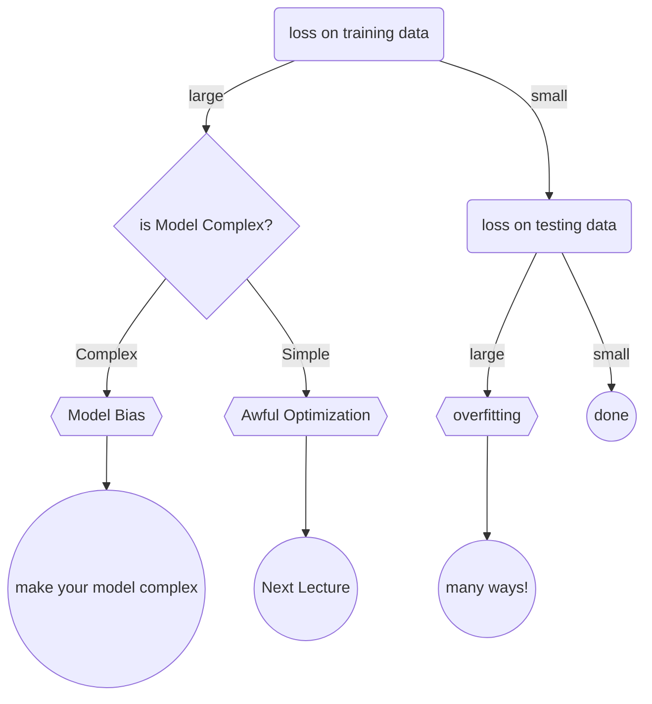

## 第二节 机器学习任务攻略

### 总体流程

```mermaid
graph TD
	A(loss on training data) -- large --> B{is Model Complex?}
	B -- Complex --> C{{Model Bias}}
	B -- Simple --> D{{Awful Optimization}}
	A -- small --> E(loss on testing data)
	E -- large --> H{{overfitting}}
	E -- small --> G((done))
	C --> I((make your model complex))
	D --> J((Next Lecture))
	H --> K((many ways!))
	
```

**Overfitting**的解决方案：

1. Less parameters, sharing parameters
2. Less features
3. Early stopping
4. Regularization
5. Dropout